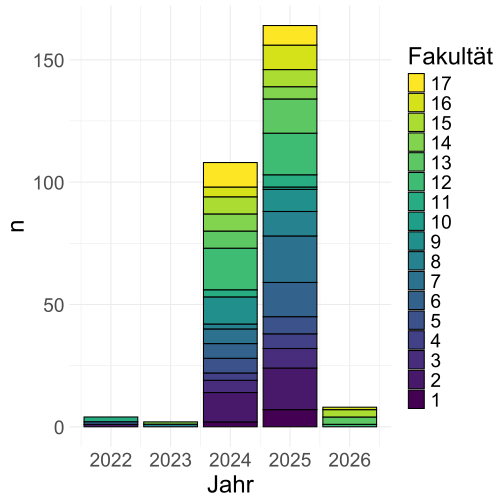

```{r setup, include=FALSE}
knitr::opts_knit$set(root.dir = "M:/digital-humanities/slides/")
setwd("M:/digital-humanities/slides/")
knitr::opts_chunk$set(echo = FALSE, message = FALSE, warning = FALSE, include = FALSE, cache = FALSE)


library(rvest)
library(stringr)
library(tidyverse)
library(viridis)
library(kableExtra)
library(knitr)

```

## Was ist DH?

bla

## Ausgangslage

```{r faculties_fdm-consulting_data}

df <- readRDS("./../data/data_processed/beratungsprotokolle_html_2026-01-20.Rda")

df <- df |> 
  filter(complete.cases(df)) |> 
  mutate(dates = as.numeric(dates)) |> 
  mutate(
    faks = as.numeric(faks), 
    fakType = case_when(
      faks %in% c(1, 2, 3, 4, 5, 6, 7, 8, 9, 10) ~ "Lower Faculties",
      faks %in% c(11) ~ "Business and Economics",
      faks %in% c(12) ~ "Education & Psychology",
      faks %in% c(13) ~ "Rehabilitation",
      faks %in% c(14) ~ "Humanities and Theology",
      faks %in% c(15) ~ "Cultural Studies",
      faks %in% c(16) ~ "Arts and Sports",
      faks %in% c(17) ~ "Social Sciences",
      TRUE ~ as.character(faks)  
    )
  ) |> 
  mutate(fakType = reorder(fakType, faks)) 
```


```{r faculties_fdm-consulting_plot}

svg("img/faculties_fdm-consulting.svg")
df |> 
  mutate(faks = as.character(faks)) |> 
  count(faks, dates) |>
  group_by(dates) |> 
  ggplot(aes(x = dates, y = n, group = reorder(faks, -as.numeric(faks)), fill = reorder(faks, -as.numeric(faks)))) +
  geom_bar(stat = 'identity', color = "black") +
  scale_fill_viridis_d(direction = -1) +
  theme_minimal() +
  labs(fill = "Fakultät", x = "Jahr") +
  theme(text = element_text(size = 24))
dev.off()
```

:::: {.columns}
::: {.column width="48%"}

:::
:::{.column width="48%"}
```{r faculties_fdm-consulting_table, include=TRUE}
df |> 
  count(faks) |> 
  filter(as.numeric(faks) >= 14) |> 
  filter(as.numeric(faks) > 10) |> 
  t() |> 
  kable()
```
:::
::::

## Ziele

## Strategie

## DH an der TUDO

## Erste Kontakte und Beispiel


