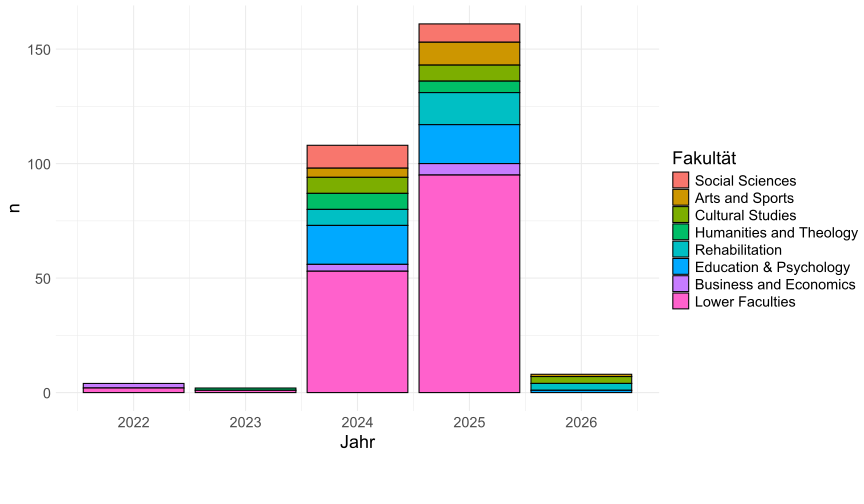
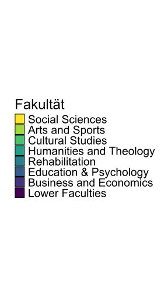

```{r setup, include=FALSE}
knitr::opts_knit$set(root.dir = "C:/Users/mdanjach/Sciebo/home/digital-humanities/slides/")
setwd("C:/Users/mdanjach/Sciebo/home/digital-humanities/slides/")
knitr::opts_chunk$set(echo = FALSE, message = FALSE, warning = FALSE, include = FALSE, cache = FALSE)

library(rvest)
library(stringr)
library(tidyverse)
library(viridis)
library(knitr)
library(gridExtra)
library(gridtext)
library(ggwordcloud)
library(ggpubr)
library(magick)
```

## Was ist DH (an der TUDO)?

Der Begriff "Digital Humanities" wird meist methodisch verstanden [@berdan2013; @schwandt2020; @wachowiak2022]. 

Gemeint sind Forschungsaktivitäten, die **informationstechnologische Methoden, Dienste und Ressourcen** in den **Gegenstandsgebieten der Geistes-, Kultur- und Sozialwissenschaften** einsetzen (an der TUDO die "höheren" Fakultäten 11 bis 17).

### Digital Humanities Ruhr

Bochum + Duisburg-Essen + Dortmund, April 2024 bis März 2026

> Ziel des Projekts [...] ist die fachübergreifende Verankerung eines Lehrangebots zu grundlegenden digitalen Kompetenzen, Werkzeugen und Methoden in den Geistes- und Gesellschaftswissenschaften ([Webseite](https://dh-ruhr.ruhr-uni-bochum.de/)).

## Ausgangslage

```{r faculties_fdm-consulting_data}
df <- readRDS("./../data/data_processed/beratungsprotokolle_html_2026-01-20.Rda")

df <- df |> 
  mutate(
    fakType = case_when(
      faks %in% c("1", "2", "3", "4", "5", "6", "7", "8", "9", "10") ~ "Lower Faculties",
      faks %in% c(11) ~ "Business and Economics",
      faks %in% c(12) ~ "Education & Psychology",
      faks %in% c(13) ~ "Rehabilitation",
      faks %in% c(14) ~ "Humanities and Theology",
      faks %in% c(15) ~ "Cultural Studies",
      faks %in% c(16) ~ "Arts and Sports",
      faks %in% c(17) ~ "Social Sciences",
      TRUE ~ as.character(faks)  
    )
  ) |> 
  mutate(fakType = factor(fakType, levels = rev(c("Lower Faculties", "Business and Economics", "Education & Psychology", "Rehabilitation", "Humanities and Theology", "Cultural Studies", "Arts and Sports", "Social Sciences", "Andere")))) 


```

```{r fdm-consulting_faculties_plots, include=FALSE}
barplot <- df |> 
  count(fakType, dates) |> 
  ggplot(aes(x = dates, y = n, group = fakType, fill = fakType)) +
  geom_bar(stat = 'identity', color = "black") +
  theme_minimal() +
  labs(fill = "Fakultät", x = "Jahr") +
  scale_fill_viridis_d(direction = -1) +
  theme(text = element_text(size = 24), legend.position = "none")

svg("img/barplot_fdm-consulting_faculties.svg", width = 9)
barplot
dev.off()

wordcloud <- df |> 
  filter(fakType != "Lower Faculties") |> 
  count(names, fakType) |> 
  ggplot(aes(label = names, size = n, colour = fakType)) +
  geom_text_wordcloud(show.legend = FALSE) +
  scale_size_area(max_size = 14) +
  theme_minimal() +
  scale_color_viridis_d(direction = -1)

svg("img/wordcloud_fdm-consulting_researchers.svg", width = 9)
wordcloud
dev.off()

img  <- image_read("img/wordcloud_fdm-consulting_researchers.svg")
img <- image_trim(img)
image_write(img, "img/wordcloud_fdm-consulting_researchers.svg")

legend <- get_legend(barplot + theme(legend.position = "right"))
svg("img/legend_fdm-consulting.svg", width = 4)
plot(legend)
dev.off()
```

::: {.columns}
:::: {.column width="68%"}

::::
:::: {.column width="28%"}

::::
:::

## Adressaten und Ziele

::: columns
:::: {.column width = "48%"}
**DH^e^** Empirisch Forschende der höheren Fakultäten mit digitaler Kompetenz und bestehendem FDM-Bedarf
::::
:::: {.column width = "48%"}
**DH^h^** Hermeneutisch Forschende der höheren Fakultäten mit digitalem Potential und Bedarf an Unterstützung bei der Einführung digitaler Methoden
::::
:::

* **Bewusstsein schaffen**: Höhere Fakultäten für die Potenziale und Risiken von FDM in der eigenen Forschung sensibilisieren.
* **Sichtbarkeit erhöhen**: Höhere Fakultäten stärker zur Verwendung bestehender FDM-Dienste der TUDO motivieren.
* **Bedarfsgerechtes Portfolio aufbauen**: FDM-Bedarfe der höheren Fakultäten erheben und decken.
* **Netzwerke bilden**: Höhere Fakultäten stärker mit dem FDM und untereinander vernetzen.

## DH-Pioniere

::: {.columns}
:::: {.column width="68%"}

::::
:::: {.column width="28%"}

::::
:::

## Erste/Nächste Schritte

* **DH-Pioniere identifizieren**: Forschende in den höheren (und in den niedrigen) Fakultäten mit DH-Kompetenz/-Potential identifizieren (Input aus Fachreferat und Referat Forschungsförderung).
* **Kontakte aufbauen, Gespräche führen**: DH-Pioniere in den höheren Fakultäten kontaktieren und im Gespräch ihre Bedarfe erheben.
* **Austauschforum etablieren**: Einen Digital Humanities-"Stammtisch" als Forum für den Peer-to-Peer-Austausch von DH-affinen Forschenden organisieren.
* **Studentischer Austausch**: Tandem-Bachelorarbeiten zwischen Studierenden der Informatik/Statistik und Studierenden der Geisteswissenschaften anstoßen.

## Kontakte aufbauen, Gespräche führen

In informellen Gesprächen gewinnen wir einen ersten Eindruck von den **Forschungsaktivitäten und -methoden**, können gezielt **Bedarfe abfragen**, bestehende **FDM-Dienste bewerben** und **geplante Projekte pitchen**.

<br>

### Erstgespräch Ellen Hilf (SFS)

 Welche typischen FDM-Szenarien gibt es an der SDS? 

 Welche FDM-Bedarfe entstehen an der SFS?

<br>

 umfangreiche Einwilligungserklärungen für Probanden 

 aufwendige Transkription von Interviewdaten 

 schwierige Anonymisierung qualitativer Daten


## Literatur


